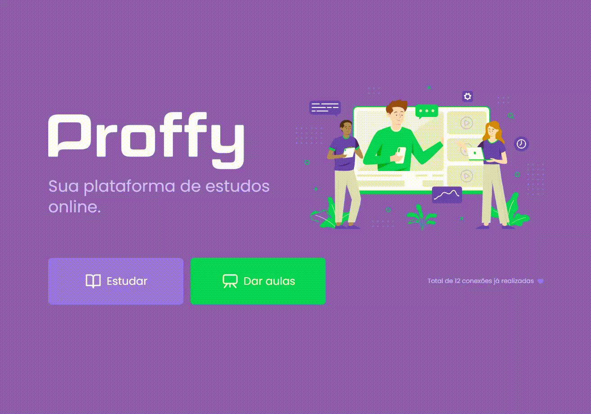

Projeto Proffy, desenvolvido na Next Level Week #2

### Tecnologias usadas
Typescript, React.js, React Native, Node.js, Express, Sqlite3, Expo

### Projeto
Desenvolvimento de uma plataforma que faz a intermediação entre alunos e professores. Os professores podem se cadastrar, informando as matérias que desejam lecionar e os horários disponíveis para as suas aulas. Os alunos, por sua vez, podem pesquisar e entrar em contato com os professores desejados.

Projeto web desenvolvido com as melhores práticas de organização de código de responsividade. 

### Resultado pessoal
Aprendi bastante, visto que estou estudando React, Node e React Native. Abriu bastante minha mente no sentido de como funciona um projeto React e React Native completo. Após a semana, aprimorei os selects com o React-select e aprendi como gerar a apk e app-bundle do projeto mobile.

### Layout mobile
